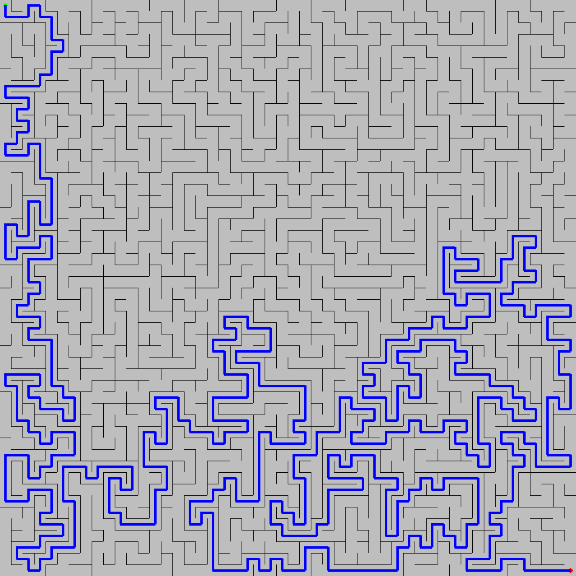

# Maze

## Introduction

POC to generate and resolve a maze.

- The maze is generated by exploring all the cells in a random order and removing walls.
- By construction the maze is always solvable, all cells are reachable.
- The resolution of the maze is based on A* algorithm.




### How to install

```
pip install -r Requirements.txt
```

### How to run

```
./App.py --dims 100x100 -s 0,0 -e 99,99
```

You can use `--dump` option to dump the generated images (as above in Introduction).

### How to use

Nothing to do, just run and watch.
